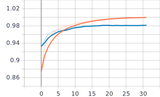
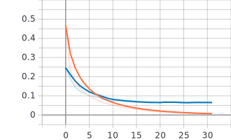

<h1>MNIST</h1>

Machine Learning and Deep Learning models for MNIST.

Used different machine learning and Deep Learning models on MNIST dataset. Here we have a different directories 
containing Deep Learning(ANN-MODEL) and Machine Learning(Classification models).

<h3>ANN-MODEL:</h3>

The dataset was loaded using "mnist = keras.datasets.mnist.load_data()".
The dataset was then Split into Training, Test and Validation Sets. Then the pixel intensities were
scaled down to 0-1 range by dividing the the X_train, X_test, anf X_valid by 255.0, we did this for just for simplicity 
and it also converted the pixel intensities into float.

Trained a sequential model containing two dense layers with (300, 100) neurons and 10 neurons in the output layer(since 
this is a multiclass classification).
We used Relu activation function with the default initialization 
technique. The Optimizer used is SGD with the Learning Rate of 0.02 and the learning rate scheduling method used is 
Performance Scheduling with factor=0.5 and patience=5. The callbacks used are Earlystopping, ModelCheckpoint with a 
Tensorboard callback for visualization.
The Model was to be trained for 50 epochs. 

In Just 36 Epochs The mode achieved an accuracy of 98.14% on the validation set.
The Evaluation accuracy on the Test set is 98.15%.

Epoch Accuracy

Epoch Loss

